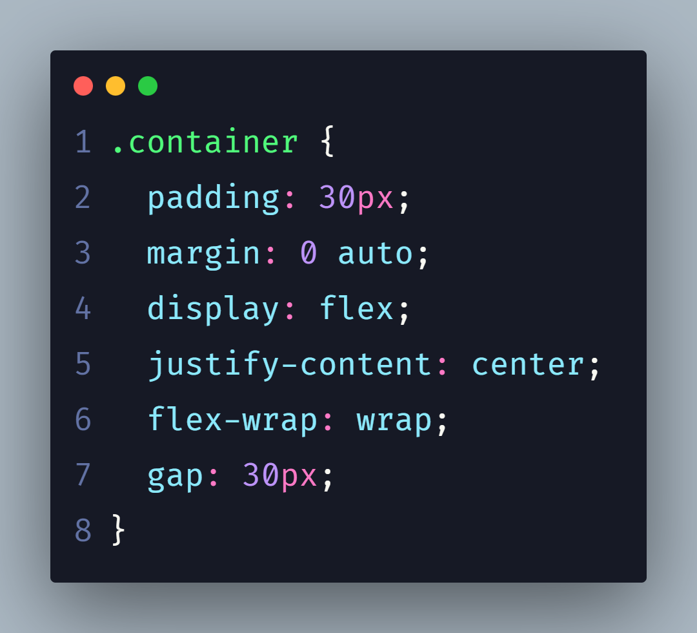

# Front-End Mentor Challenge

# Testimonials Grid Section

Esse challenge do Front-End Mentor é voltado para o treinamento de ferramentas CSS, como Display Flex e Display Grid.

Foi utilizado o conceito de Mobile First, onde foi realizado primeiramente a estilização da página para dispositivos Mobile, após isso é realizado a estilização para dispositivos Desktop, utilizando Media Query.

Poderá visualizar nesse <a href="" target="_blank">Link</a>

# Display Flex

Foi utilizado o Display Flex por conta de sua responsividade.

  
  

# Display Grid

  
  

# Mobile

  
  

# Desktop

